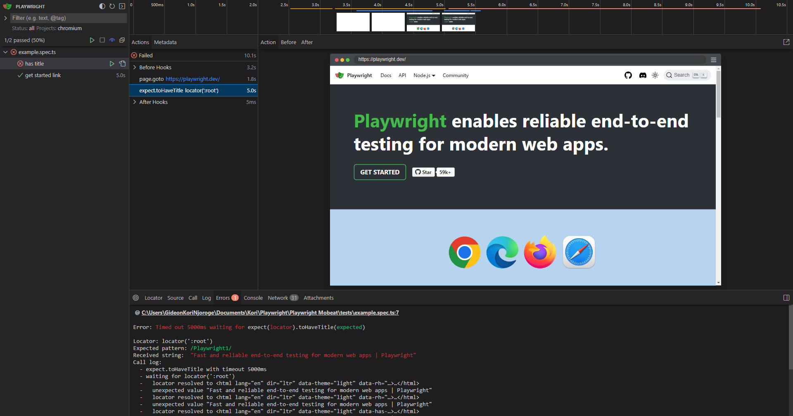
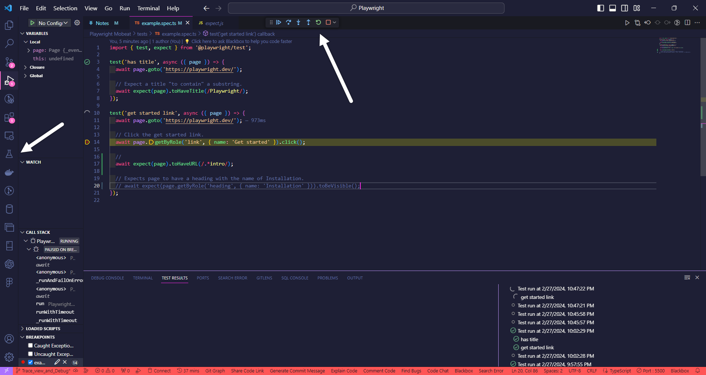

<!-- Running Playwight with CLI -->
Installing Playwright  - npm Playwright@latest >> follow the process to create the intial template
Running all Tests on all browsers available - npx playwright Tests
Running Playwright on a single browser - npx playwright test --project=browsername
Generating the report for the lates run - npx playwright show report
Executing a single file among many in all browsers- npx playwright test example.spec.ts
Executing a single file among many in a single browser- npx playwright test example.spec.ts --project=browsername
Executing a specific test in a file - npx playwright test -g "test name"
test.skip() ->> Skips the test when the test file is run
test.only() ->> only runs the single test

<!--Running Playwright on UI  -->
run in terminal - npx playwright test --ui

<!-- Trace view and Debug -->
npx playwright test --project=chromium --trace on - to run the tests and trace
npx playwright test --project=chromium --debug - to run the tests and trace
1. VS code 

<!-- Hooks and Flow control -->
1. test.beforeEach() - executes the code inside before each test is run.
2. test.beforeAll() - used before anything is done in your test file.
2 test.afterEach() - maybe to clear some test data inserted in the db.

<!-- only and skip for test suites -->
test.describe.only() - executes only the test suite
test.describe.skip() - skipping the whole test suite
test.it.only() - executing only

<!-- Test your knowledge -->
Which command is correct to run test with a title "first test" in a headed mode for "chromium" project? 
 => npx playwright test --project=chromium -g "first test" --headed

 <!-- Test timeout -->
 1. test.slow() - increases the default timeout by three times
 2. testInfo.setTimeout(testInfo.timeout + 5000); // adding 5 seconds more time to the test
3. test.settimeout - set default time out

> **in the playwight config file**
expect:{
    timeout: 2000
}
